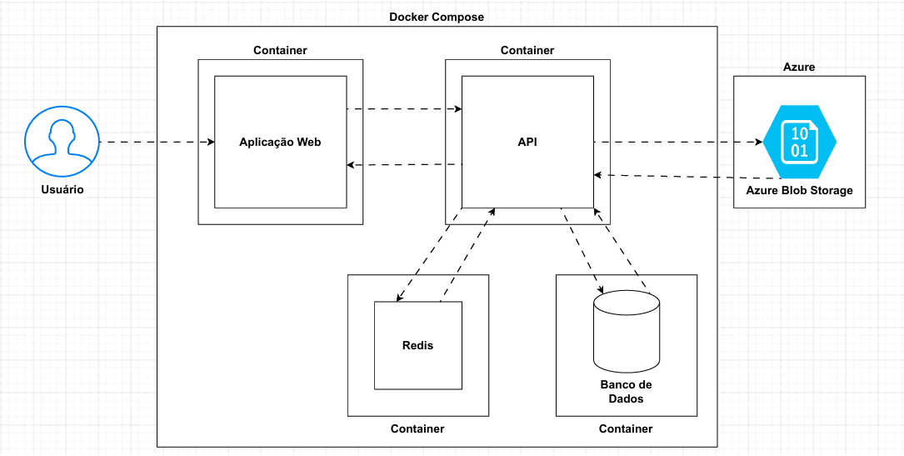

# ClientHub

## Decisões e guias
```
 
 - O backend foi desenvolvido utilizando a Arquitetura Limpa, visando aplicar os conceitos de DDD e padrões SOLID, além da organização para a expansão do projeto quando necessário e a criação de testes.
 - O frontend foi desenvolvido no padrão MVC também para manter a separação de responsabilidades e organização do projeto.
 - Utilização de containerês para permitir a escalabilidade horizontal da aplicação, além de estar pronto para nuvem.
 - Docker-compose para facilitar a execução e deploy do projeto e suas dependências.
 - O armazenamento de imagens é feito através de um container de armazenamento do azure (Blob Storage), salvando no banco de dados uma URL gerada para a imagem que foi armazenada, essa url é persistida no banco de dados e utilizada como fonte para ser exibida na aplicação Web
```

## Requisitos
```
 - .NET 8
 - Docker
 - SSMS (Ou similar para execução de script no banco de dados)
```

## Instruções para Execução
```
 1. Navegar através do Powershell até o diretório do projeto, onde está presente o arquivo docker-compose.yml
 2. Executar o comando: docker-compose up
 3. Após a conclusão, a aplicação estará em execução, tanto frontend, backend, banco de dados e serviço de caching.
 4. Realizar a conexão com o banco de dados, através do SSMS, com as seguintes informações:
   - Nome do Servidor: localhost,1433
   - Autenticação: Autenticação do SQL Server
   - Logon: sa
   - Senha: 84sd62aA!0
 5. Clicar em nova consulta e executar os comandos encontrados no arquivo 'init.sql', também presente no diretório do projeto.
 6. Acessar através do navegador 'http://localhost:9090' e explorar a aplicação

 Obs: Caso estiver utilizando Visual Studio, base abrir a solução, selecionar docker-compose como modo de execução e iniciar
```
